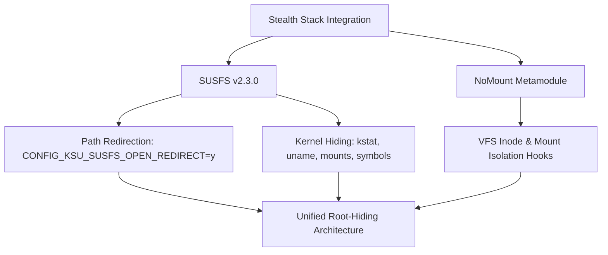

# GKI Root, Stealth, & NetHunter Variants (Android 16 - 6.12.30)

This document details the root implementations, stealth modules, coexistence strategies, and penetration testing integrations supported by **`gki_kernel_builder`** for the **Android 16 GKI (Kernel 6.12.30 / 2025-07)** target.

---

## 1. Supported Root Implementations

The build system supports three distinct root flavors selectable via the `root_flavor` workflow input. Each flavor is isolated and cleanly integrated during build time:

| Root Flavor | Upstream Repository | Default Branch / Target | Integration Mechanism |
| :--- | :--- | :--- | :--- |
| **KernelSU-Next** *(Default)* | [pershoot/KernelSU-Next](https://github.com/pershoot/KernelSU-Next) | `dev-susfs` | Native SUSFS support; driver symlinked to `common/drivers/kernelsu`. |
| **SukiSU-Ultra** | [SukiSU-Ultra/SukiSU-Ultra](https://github.com/SukiSU-Ultra/SukiSU-Ultra) | `main` | Kernel-level root solution & KPM engine; native SUSFS compatibility. |
| **ReSukiSU** | [ReSukiSU/ReSukiSU](https://github.com/ReSukiSU/ReSukiSU) | `main` | Alternative hooking integration; compatible with SUSFS and NoMount. |

---

## 2. Stealth & Hook Coexistence Architecture

To achieve comprehensive root hiding while maintaining stability and compatibility, the build integrates both SUSFS and NoMount:



### Key Stealth Components:
1. **SUSFS v2.3.0** (`simonpunk/susfs4ksu`):
   * Target branch: `gki-android16-6.12`
   * Provides suspicious path hiding, fake mount IDs (`mnt_id`), kstat spoofing, `uname` spoofing, and symbol hiding from `/proc/kallsyms`.
2. **NoMount VFS Hooks** (`maxsteeel/nomount`):
   * Injects low-level VFS mounting stealth hooks directly into kernel filesystem structures.
3. **Unconditional Open Redirect**:
   * `CONFIG_KSU_SUSFS_OPEN_REDIRECT=y` is always enabled, ensuring path redirection works seamlessly alongside NoMount.

---

## 3. Toolchain & Clang 6.12 Compatibility Fixes

Android 16 GKI kernels are built with Google's modern Clang toolchain under strict `-Werror` flags. The builder applies automated fixes during preparation:

* **`selinux_hide.c` Pointer-Bool Conversion**:
  Modern Clang flags `if (security_dump_masked_av_fn)` as `-Wpointer-bool-conversion` or `-Wtautological-pointer-compare` when turned into an extern function by SUSFS.
  The build workflow automatically scans and patches `selinux_hide.c` across all root flavors to use proper `&func != NULL` or `func != NULL` pointer comparisons.
* **Module Versioning Bypass**:
  The Bazel vendor module versioning bypass (`bad_version: return 1;` in `common/kernel/module/version.c`) is baked in automatically by default, producing a single flashable `Image` compatible with Xiaomi HyperOS 3 and other strict OEM ROMs.

---

## 4. Kali NetHunter & Wireless Driver Stack

The kernel integrates full Kali NetHunter capabilities natively into the 6.12 GKI tree:

* **HID Keyboard & BadUSB Attack**:
  * Emulates USB HID keyboard and mouse devices via `CONFIG_USB_CONFIGFS_F_HID=y`, `CONFIG_USB_F_HID=y`, and `/dev/hidg*` endpoints for high-speed DuckyScript keystroke injection.
* **USB Arsenal & Hardware Hacking**:
  * Emulates CDC-ACM serial (`CONFIG_USB_CONFIGFS_ACM=y`, `CONFIG_USB_ACM=y`) for Proxmark3 and ChameleonMini RFID cloning.
  * USB Mass Storage gadget (`CONFIG_USB_CONFIGFS_MASS_STORAGE=y`) for DriveDroid and ISO delivery.
  * USB Ethernet gadgets (`CONFIG_USB_CONFIGFS_RNDIS=y`, `CONFIG_USB_CONFIGFS_ECM=y`, `CONFIG_USB_CONFIGFS_NCM=y`) for PoisonTap and USB Ethernet MITM.
  * USB UART converters (`FTDI`, `CH341`, `CP210X`, `PL2303`) for router UART & embedded hardware hacking.
* **Monitor Mode & Packet Injection**: Enabled in-tree via `CONFIG_CFG80211=y` and `CONFIG_MAC80211=y`.
* **Modular USB WiFi Drivers (`=m`)**:
  * Realtek: `rtw88` (802.11ac), `rtl8xxxu` (802.11n), `rtl8187`, `rtl8192cu`
  * Atheros: `ath9k_htc` (AR9271), `carl9170`, `ath6kl`
  * MediaTek / Ralink: `mt7601u`, `mt76x0u`, `mt76x2u`, `rt2800usb` (RT3070/RT5370), `rt2500usb`, `rt73usb`
  * ZyDAS: `zd1211rw`, `zd1201`
* **Software-Defined Radio (SDR)**: RTL-SDR (`RTL2832U`), HackRF One (`CONFIG_USB_HACKRF=m`), AirSpy (`CONFIG_USB_AIRSPY=m`), Mirics (`CONFIG_USB_MSI2500=m`).
* **Automotive Hacking (CARsenal)**: SocketCAN (`CONFIG_CAN=m`, `CONFIG_CAN_RAW=m`, `CONFIG_CAN_DEV=m`, `CONFIG_CAN_BCM=m`, `CONFIG_CAN_GW=m`), `vcan`, `slcan`, `PEAK PCAN-USB`, `Kvaser`, `EMS USB`.
* **Network File Systems**: NFS client/server (`CONFIG_NFS_FS=y`, `CONFIG_NFSD=y`) and CIFS/SMB (`CONFIG_CIFS=y`).
* **Flashable Wireless & Driver Module (`Nethunter-Wireless-Modules.zip`)**:
  All compiled `.ko` driver modules, official Linux firmware blobs, ueventd hotplug rules, and the interactive WebUI dashboard are packaged into a standalone module with automated multi-pass boot loaders.

---

## 5. NetHunter WebUI & Module Architecture

The `Nethunter-Wireless-Modules.zip` module embeds a full-featured, mobile-first Material 3 management dashboard designed for operational penetration testing:

```mermaid
flowchart TD
    subgraph UI["WebUI Layer (webroot/index.html)"]
        WB[Root Bridge Detection] --> KSU[window.ksu / KernelSU / APatch]
        WB --> SUKI[window.suki / SukiSU / ReSukiSU]
        WB --> BR[Browser Preview: Read-Only Fallback]
    end

    subgraph Core["Interactive Subsystems"]
        KSU & SUKI --> NET[TCP Congestion Switcher: BBR3/BBR/Cubic]
        KSU & SUKI --> USB[BadUSB HID Gadget: /dev/hidg* & Storage]
        KSU & SUKI --> DRV[Modular Driver Loader: Multi-Tier Dependencies]
        KSU & SUKI --> MEM[Dynamic MGLRU & Real-Time RAM Telemetry]
        KSU & SUKI --> TRM[Rooted Web Terminal Console]
    end

    subgraph OS["Kernel & Android OS Integration"]
        NET --> SYS1[/proc/sys/net/ipv4/tcp_congestion_control]
        USB --> SYS2[/config/usb_gadget/g1 & /dev/hidg*]
        DRV --> SYS3[insmod /data/adb/modules/.../lkm/*.ko]
        MEM --> SYS4[/sys/kernel/mm/lru_gen/enabled]
    end
```

### Key Technical Characteristics:
1. **Multi-Root Bridge Support**:
   * Inspects `window.ksu` (KernelSU, APatch) and `window.suki` (SukiSU-Ultra, ReSukiSU).
   * Automatically disables live mutation buttons and displays informational warning chips when opened in standard unrooted mobile browsers.
2. **Dynamic Telemetry & Parsing**:
   * **TCP Protocols**: Dynamically reads `/proc/sys/net/ipv4/tcp_available_congestion_control` and generates clickable algorithm chips for all active kernel algorithms.
   * **True RAM Usage**: Parses `/proc/meminfo` and calculates true memory consumption: $\text{Used} = \text{MemTotal} - \text{MemAvailable}$.
   * **MGLRU Locking**: Reads `/sys/kernel/mm/lru_gen/enabled` and allows one-tap locking to `0x0007` (full multi-generational generation & evictions).
   * **ZRAM Telemetry**: Extracts active compression algorithm (e.g., `lz4`, `zstd`) and allocated disk size directly from `/sys/block/zram0/`.
3. **BadUSB HID Hotplug & Controls**:
   * Automatically provisions keyboard and mouse endpoints via ConfigFS (`/dev/hidg0` and `/dev/hidg1`).
   * Includes one-tap switching back to Stock Android (MTP + ADB) or USB Mass Storage, alongside an on-screen DuckyScript test keystroke injector.
4. **Resilient Driver Loading & Unloading**:
   * **Multi-Tier Dependency Resolution**: Loads base silicon modules (`rtw88_8822c`, `rtw88_8821c`, `rtw88_core`, `mac80211`, `cfg80211`) before binding USB interface frontends.
   * **Reverse-Order Driver Unloading**: Resets external drivers in reverse dependency order to prevent kernel `"device or resource busy"` unbind errors.
5. **Recovery & Public Storage Synchronization**:
   * Dual-pass synchronization: copies `webroot/index.html` to `/storage/emulated/0/Download/nethunter_webui.html` both at installation (`customize.sh`) and at late boot (`service.sh`).
   * Ensures the file is populated and accessible even when flashed from TWRP/OrangeFox recovery prior to storage decryption.
   * Launched safely via `action.sh` avoiding Android `/data/adb` cross-application file exposure restrictions.

---

## 6. Generated Build Artifacts

Every completed build workflow produces structured release and testing assets:

1. **`*-Bundle.zip`**: All-in-one release bundle containing the root flavor's `AnyKernel3.zip`, matching Manager `APK`, NetHunter driver module, and NoMount metamodule.
2. **`AnyKernel3.zip`**: Flashable kernel installer containing the bypassed kernel `Image`.
3. **`Nethunter-Wireless-Modules.zip`**: Flashable KernelSU-Next / SukiSU-Ultra / ReSukiSU / APatch module for external USB WiFi dongles, firmware, BadUSB, and WebUI manager.
4. **`NoMount-Metamodule.zip`**: Standalone NoMount companion module matching the kernel's exact commit SHA.
5. **`*-Manager.apk`**: Matching Root Manager APK automatically fetched for the selected root flavor.
6. **`Build-Summary.md`**: Detailed provenance metadata containing compiler strings, KSU tag, commit SHAs, and active feature flags.
