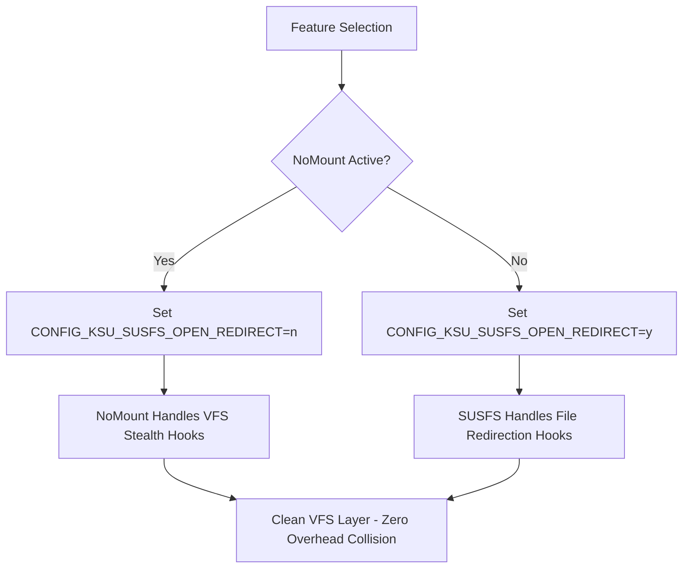

# GKI Root, Stealth, & NetHunter Variants (Android 16 - 6.12.30)

This document details the root implementations, stealth modules, coexistence strategies, and penetration testing integrations supported by **`gki_kernel_builder`** for the **Android 16 GKI (Kernel 6.12.30 / 2025-07)** target.

---

## 1. Supported Root Implementations

The build system supports three distinct root flavors selectable via the `root_flavor` workflow input. Each flavor is isolated and cleanly integrated during build time:

| Root Flavor | Upstream Repository | Default Branch / Target | Integration Mechanism |
| :--- | :--- | :--- | :--- |
| **KernelSU-Next** *(Default)* | [pershoot/KernelSU-Next](https://github.com/pershoot/KernelSU-Next) | `dev-susfs` | Native SUSFS support; driver symlinked to `common/drivers/kernelsu`. |
| **SukiSU-Ultra** | [SukiSU-Ultra/SukiSU-Ultra](https://github.com/SukiSU-Ultra/SukiSU-Ultra) | `main` | Kernel-level root solution & KPM engine; native SUSFS compatibility. |
| **ReSukiSU** | [ReSukiSU/ReSukiSU](https://github.com/ReSukiSU/ReSukiSU) | `main` | Alternative hooking integration; compatible with SUSFS and NoMount. |

---

## 2. Stealth & Hook Coexistence Architecture

To achieve root hiding while avoiding kernel overhead and VFS hook collisions, the build implements dynamic coexistence rules:

### Key Stealth Components:
1. **SUSFS v2.3.0** (`simonpunk/susfs4ksu`):
   * Target branch: `gki-android16-6.12`
   * Provides suspicious path hiding, fake mount IDs (`mnt_id`), kstat spoofing, `uname` spoofing, and symbol hiding from `/proc/kallsyms`.
2. **NoMount VFS Hooks** (`maxsteeel/nomount`):
   * Injects low-level VFS mounting stealth hooks directly into kernel filesystem structures.
3. **Automated Coexistence Toggle**:
   * When NoMount is enabled (`nomount_enabled: "true"`), `CONFIG_KSU_SUSFS_OPEN_REDIRECT` is automatically disabled (`=n`).
   * When NoMount is absent, `CONFIG_KSU_SUSFS_OPEN_REDIRECT` is enabled (`=y`).

---

## 3. Toolchain & Clang 6.12 Compatibility Fixes

Android 16 GKI kernels are built with Google's modern Clang toolchain under strict `-Werror` flags. The builder applies automated fixes during preparation:

* **`selinux_hide.c` Pointer-Bool Conversion**:
  Modern Clang flags `if (security_dump_masked_av_fn)` as `-Wpointer-bool-conversion` or `-Wtautological-pointer-compare` when turned into an extern function by SUSFS.
  The build workflow automatically scans and patches `selinux_hide.c` across all root flavors to use proper `&func != NULL` or `func != NULL` pointer comparisons.
* **Module Versioning Bypass**:
  The Bazel vendor module versioning bypass (`bad_version: return 1;` in `common/kernel/module/version.c`) is baked in automatically by default, producing a single flashable `Image` compatible with Xiaomi HyperOS 3.0.302 and other strict OEM ROMs.

---

## 4. Kali NetHunter & Wireless Driver Stack

The kernel integrates full Kali NetHunter capabilities natively into the 6.12 GKI tree:

* **HID Keyboard & BadUSB Attack**:
  * Emulates USB HID keyboard and mouse devices via `CONFIG_USB_CONFIGFS_F_HID=y`, `CONFIG_USB_F_HID=y`, and `/dev/hidg*` endpoints for high-speed DuckyScript keystroke injection.
* **USB Arsenal & Hardware Hacking**:
  * Emulates CDC-ACM serial (`CONFIG_USB_CONFIGFS_ACM=y`, `CONFIG_USB_ACM=y`) for Proxmark3 and ChameleonMini RFID cloning.
  * USB Mass Storage gadget (`CONFIG_USB_CONFIGFS_MASS_STORAGE=y`) for DriveDroid and ISO delivery.
  * USB Ethernet gadgets (`CONFIG_USB_CONFIGFS_RNDIS=y`, `CONFIG_USB_CONFIGFS_ECM=y`, `CONFIG_USB_CONFIGFS_NCM=y`) for PoisonTap and USB Ethernet MITM.
  * USB UART converters (`FTDI`, `CH341`, `CP210X`, `PL2303`) for router UART & embedded hardware hacking.
* **Monitor Mode & Packet Injection**: Enabled in-tree via `CONFIG_CFG80211=y` and `CONFIG_MAC80211=y`.
* **Modular USB WiFi Drivers (`=m`)**:
  * Realtek: `rtw88` (802.11ac), `rtl8xxxu` (802.11n), `rtl8187`, `rtl8192cu`
  * Atheros: `ath9k_htc` (AR9271), `carl9170`, `ath6kl`
  * MediaTek / Ralink: `mt7601u`, `mt76x0u`, `mt76x2u`, `rt2800usb` (RT3070/RT5370), `rt2500usb`, `rt73usb`
  * ZyDAS: `zd1211rw`, `zd1201`
* **Software-Defined Radio (SDR)**: RTL-SDR (`RTL2832U`), HackRF One (`CONFIG_USB_HACKRF=m`), AirSpy (`CONFIG_USB_AIRSPY=m`), Mirics (`CONFIG_USB_MSI2500=m`).
* **Automotive Hacking (CARsenal)**: SocketCAN (`CONFIG_CAN=m`, `CONFIG_CAN_RAW=m`, `CONFIG_CAN_DEV=m`, `CONFIG_CAN_BCM=m`, `CONFIG_CAN_GW=m`), `vcan`, `slcan`, `PEAK PCAN-USB`, `Kvaser`, `EMS USB`.
* **Network File Systems**: NFS client/server (`CONFIG_NFS_FS=y`, `CONFIG_NFSD=y`) and CIFS/SMB (`CONFIG_CIFS=y`).
* **Flashable Wireless & Driver Module**:
  All compiled `.ko` driver modules, official Linux firmware blobs, and HID permission daemons are packaged into a standalone KernelSU-Next / SukiSU-Ultra / ReSukiSU module (`Nethunter-Wireless-Modules.zip`) with an automated boot-time `service.sh` driver loader.

---

## 5. Generated Build Artifacts

Every completed build workflow produces structured release and testing assets:

1. **`*-Bundle.zip`**: All-in-one release bundle containing the root flavor's `AnyKernel3.zip`, matching Manager `APK`, NetHunter driver module, and NoMount metamodule.
2. **`AnyKernel3.zip`**: Flashable kernel installer containing the bypassed kernel `Image`.
3. **`Nethunter-Wireless-Modules.zip`**: Flashable KernelSU-Next / SukiSU-Ultra / ReSukiSU module for external USB WiFi dongles and firmware.
4. **`NoMount-Metamodule.zip`**: Standalone NoMount companion module matching the kernel's exact commit SHA.
5. **`*-Manager.apk`**: Matching Root Manager APK automatically fetched for the selected root flavor.
6. **`Build-Summary.md`**: Detailed provenance metadata containing compiler strings, KSU tag, commit SHAs, and active feature flags.
